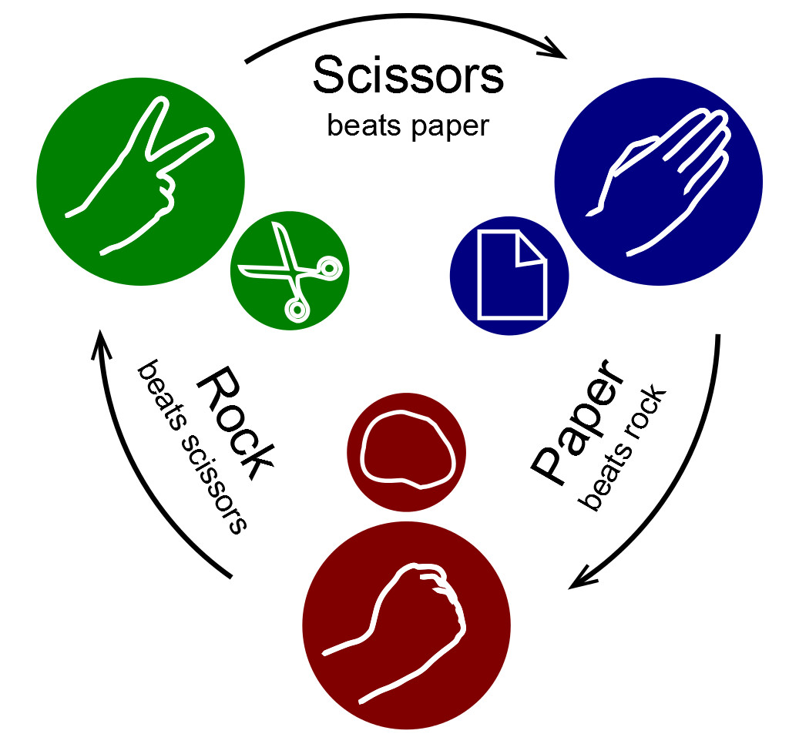

<details>
<summary>
<strong> Leia este guia em Inglês. </strong>
</summary>
    <ul>
        <li><a href="./README.md"> English</a></li>
    </ul>

</details>

# Pedra Papel Tesoura

<p align="center"></p>

Programa de linha de comando que você pode jogar pedra, papel e tesoura com o computador. Veja quem ganha cada rodada!

## Regras do jogo:

- Tesoura bate papel.
- Papel bate pedra.
- Pedra bate tesoura.

### Para executar o aplicativo, basta escrever o seguinte comando:

```bash
dart lib/main.dart
```

### Comandos (Movimentos):

- **r** - pedra
- **p** - papel
- **s** - tesoura
- **q** - sair do programa

⚠️ **O jogo será repetido** até você **sair** digitando **"q".**
