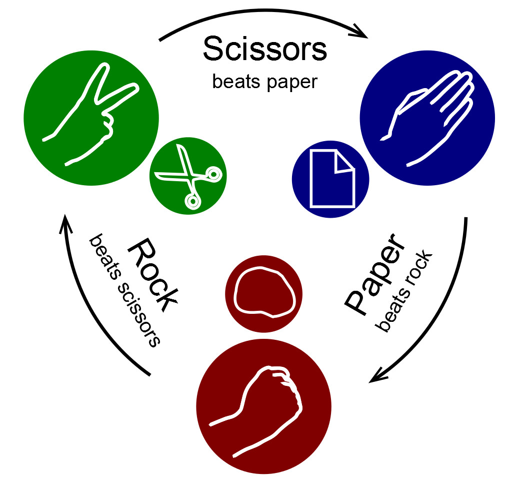

<details>
<summary>
<strong> Leia este guia em Português </strong>
</summary>
    <ul>
        <li><a href="./README-PT-BR.md"> Português </a></li>
    </ul>

</details>

# Rock Paper & Scissors

<p align="center"></p>

Command line tool that you can play rock, paper and scissors with the computer. See who wins each round!

## Rules of the Game:

- Scissors beats paper.
- Paper beats rock.
- Rock beats scissors.

### To run the app, simply write the following command:

```bash
dart lib/main.dart
```

### Commands (Moves):

- **r** - rock
- **p** - paper
- **s** - scissor
- **q** - quit the program

⚠️ **The game will repeat** until you **quit by** entering **"q".**
